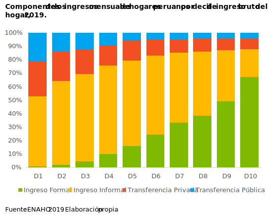

<b>Resume</b>

---

Estudiante de quinto año de economía en la Universidad Nacional Mayor de San Marcos, caracterizado por ser responsable, analítico y proactivo. Cuento con experiencia en análisis e interpretación de datos; y una formación sólida en estadística e investigación cuantitativa. Gran interés en <i>data science for social good</i> y en <i>analytics</i>. En mis ratos libres me gusta ver temas de sociología, economía política, y algunos <i>topics</i> de programación.

---
---

<b>Estudios</b>

### Economía, Universidad Nacional Mayor de San Marcos

Desde abril de 2015 hasta la actualidad. 9.º ciclo, quinto superior. Fecha esperada de egreso: marzo de 2021.
   
   
Asignaturas preferidas: Estadística, Microeconomía, Econometría de Corte Transversal y Datos de Panel, Informática, Sociología.

---
---

<b>Prácticas</b>

### Macroconsult

Empresa dedicada a brindar servicios de consultoría económica. Como practicante preprofesional de estudios económicos en el área de Desarrollo Económico y Social; participé en proyectos de evaluación de impacto. Entre mis actividades se encontraron la revisión de literatura afín a las intervenciones, y gestión de bases de datos. También participé de forma indirecta en otros proyectos ocupándome principalmente de la estimación de indicadores. Estuve en la empresa en dos oportunidades: desde octubre de 2018 hasta marzo de 2019, y desde enero de 2020 hasta julio del mismo año.

---
---

<b>Cursos</b>

He llevado algunos cursos externos orientados a investigación cuantitativa, ciencia de datos y programación. Una breve descripción de —casi— todos ellos se encuentra en el siguiente link: <a href="https://drodrigo96.github.io/courses_page">CURSOS</a>.

---
---

<b>Skills</b>

### Idiomas
Spanish, native. English, advanced.
### Software

MS Office, upper intermediate. Stata, upper intermediate. Python 3, intermediate. RStudio, basics. SQL/MySQL, basics.

---
---

  COVID-19, contagios por distrito
   
   
  <iframe src="https://drodrigo96.github.io/COVID19.html" width="400" height="400"></iframe>
 

---

  Un nuevo premier. ¿Qué dijo Walter Martos?
   
   
  
 

---

  PE: Educación e ingreso 2019
   
   
  

---

  Índice de proximidad física por sector económico
   
   
  

---

  Componentes del ingreso en los hogares peruanos
   
   
  

---

Page template forked from <a href="https://github.com/evanca">evanca</a>

<!-- Remove above link if you don't want to attibute -->
