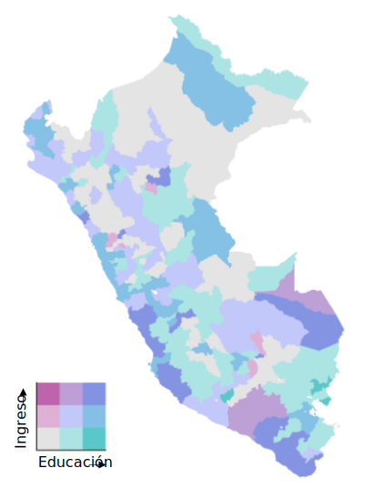
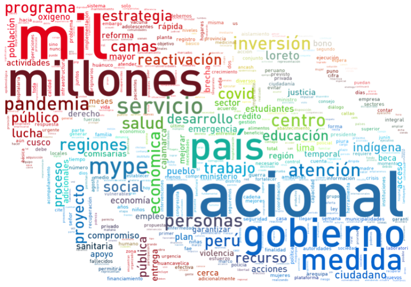

<b>Resume</b>

---

Estudiante de quinto año de economía en la Universidad Nacional Mayor de San Marcos, caracterizado por ser responsable, analítico y proactivo. Cuento con experiencia en análisis e interpretación de datos; y una formación sólida en estadística e investigación cuantitativa. Gran interés en <i>data science for social good</i> y en <i>analytics</i>. En mis ratos libres me gusta ver temas de sociología, economía política, y algunos <i>topics</i> de programación.

---
---

<b>Estudios</b>

### Economía, Universidad Nacional Mayor de San Marcos
<!---->

Desde abril de 2015 hasta la actualidad. 9.º ciclo, quinto superior. Fecha esperada de egreso: marzo de 2021.
   
   
Asignaturas preferidas: Estadística, Microeconomía, Econometría de Corte Transversal y Datos de Panel, Informática, Sociología.

---
---

<b>Prácticas</b>

### Macroconsult
<!---->

Empresa dedicada a brindar servicios de consultoría económica. Como practicante preprofesional de estudios económicos en el área de Desarrollo Económico y Social; participé en proyectos de evaluación de impacto. Entre mis actividades se encontraron la revisión de literatura afín a las intervenciones, y gestión de bases de datos. También participé de forma indirecta en otros proyectos ocupándome principalmente de la estimación de indicadores. Estuve en la empresa en dos oportunidades: desde octubre de 2018 hasta marzo de 2019, y desde enero de 2020 hasta julio del mismo año.

---
---

<b>Cursos</b>

He llevado algunos cursos externos orientados a investigación cuantitativa, ciencia de datos y programación. Una breve descripción de —casi— todos ellos se encuentra en el siguiente link: <a href="https://drodrigo96.github.io/courses_page">CURSOS</a>.

---
---

<b>Skills</b>

### Idiomas
Spanish, native. English, advanced.

<b>Software</b>

   <head>
      <title>Google Charts Tutorial</title>
      
      
   </head>
   <body>
      

      

      
   </body>
   
---
---

  <a href="https://nbviewer.jupyter.org/github/DRodrigo96/SomeProjects/blob/master/Contagio%20COVID-19/Covid19%20Mapa%20Distrital.ipynb" target="_blank">COVID-19.PE: contagios por distrito</a>
   
   
  <iframe src="https://drodrigo96.github.io/COVID19.html" width="400" height="400"></iframe>
 

---

  Perú: educación e ingreso provincial 2019
   
   
  

---

  <a href="https://nbviewer.jupyter.org/github/DRodrigo96/SomeProjects/blob/master/Martos%20WordCloud/MartosCloud.ipynb" target="_blank">Un nuevo premier, ¿qué dijo Walter Martos?</a>
   
   
  
 

 
---

  <a href="https://github.com/DRodrigo96/SomeProjects/tree/master/PE%20%C3%ADndice%20de%20proximidad" target="_blank">Índice de proximidad física por sector económico</a>
   
   
  <svg viewBox="0 0 593 397" width="400" height="267" xmlns="http://www.w3.org/2000/svg" xmlns:xlink="http://www.w3.org/1999/xlink" overflow="hidden"><defs><clipPath id="clip0"><rect x="310" y="179" width="593" height="397"/></clipPath><clipPath id="clip1"><rect x="310" y="179" width="592" height="395"/></clipPath><clipPath id="clip2"><rect x="310" y="179" width="592" height="395"/></clipPath><clipPath id="clip3"><rect x="375" y="188" width="505" height="334"/></clipPath><clipPath id="clip4"><rect x="375" y="188" width="505" height="334"/></clipPath><clipPath id="clip5"><rect x="375" y="188" width="505" height="334"/></clipPath><clipPath id="clip6"><rect x="375" y="188" width="505" height="334"/></clipPath><clipPath id="clip7"><rect x="375" y="188" width="505" height="334"/></clipPath><clipPath id="clip8"><rect x="375" y="188" width="505" height="334"/></clipPath><clipPath id="clip9"><rect x="375" y="188" width="505" height="334"/></clipPath><clipPath id="clip10"><rect x="375" y="188" width="505" height="334"/></clipPath><clipPath id="clip11"><rect x="375" y="188" width="505" height="334"/></clipPath><clipPath id="clip12"><rect x="375" y="188" width="505" height="334"/></clipPath><clipPath id="clip13"><rect x="375" y="188" width="505" height="334"/></clipPath><clipPath id="clip14"><rect x="375" y="188" width="505" height="334"/></clipPath><clipPath id="clip15"><rect x="375" y="188" width="505" height="334"/></clipPath><clipPath id="clip16"><rect x="375" y="188" width="505" height="334"/></clipPath><clipPath id="clip17"><rect x="375" y="188" width="505" height="334"/></clipPath><clipPath id="clip18"><rect x="310" y="179" width="592" height="395"/></clipPath><clipPath id="clip19"><rect x="310" y="179" width="592" height="395"/></clipPath><clipPath id="clip20"><rect x="310" y="179" width="592" height="395"/></clipPath><clipPath id="clip21"><rect x="310" y="179" width="592" height="395"/></clipPath><clipPath id="clip22"><rect x="310" y="179" width="592" height="395"/></clipPath><clipPath id="clip23"><rect x="310" y="179" width="592" height="395"/></clipPath><clipPath id="clip24"><rect x="310" y="179" width="592" height="395"/></clipPath><clipPath id="clip25"><rect x="310" y="179" width="592" height="395"/></clipPath><clipPath id="clip26"><rect x="310" y="179" width="592" height="395"/></clipPath><clipPath id="clip27"><rect x="310" y="179" width="592" height="395"/></clipPath><clipPath id="clip28"><rect x="310" y="179" width="592" height="395"/></clipPath><clipPath id="clip29"><rect x="310" y="179" width="592" height="395"/></clipPath><clipPath id="clip30"><rect x="310" y="179" width="592" height="395"/></clipPath><clipPath id="clip31"><rect x="310" y="179" width="592" height="395"/></clipPath><clipPath id="clip32"><rect x="310" y="179" width="592" height="395"/></clipPath><clipPath id="clip33"><rect x="310" y="179" width="592" height="395"/></clipPath><clipPath id="clip34"><rect x="310" y="179" width="592" height="395"/></clipPath><clipPath id="clip35"><rect x="310" y="179" width="592" height="395"/></clipPath><clipPath id="clip36"><rect x="310" y="179" width="592" height="395"/></clipPath><clipPath id="clip37"><rect x="310" y="179" width="592" height="395"/></clipPath><clipPath id="clip38"><rect x="310" y="179" width="592" height="395"/></clipPath><clipPath id="clip39"><rect x="310" y="179" width="592" height="395"/></clipPath><clipPath id="clip40"><rect x="310" y="179" width="592" height="395"/></clipPath><clipPath id="clip41"><rect x="310" y="179" width="592" height="395"/></clipPath><clipPath id="clip42"><rect x="310" y="179" width="592" height="395"/></clipPath><clipPath id="clip43"><rect x="310" y="179" width="592" height="395"/></clipPath><clipPath id="clip44"><rect x="310" y="179" width="592" height="395"/></clipPath><clipPath id="clip45"><rect x="310" y="179" width="592" height="395"/></clipPath><clipPath id="clip46"><rect x="310" y="179" width="592" height="395"/></clipPath><clipPath id="clip47"><rect x="310" y="179" width="592" height="395"/></clipPath><clipPath id="clip48"><rect x="310" y="179" width="592" height="395"/></clipPath><clipPath id="clip49"><rect x="310" y="179" width="592" height="395"/></clipPath><clipPath id="clip50"><rect x="310" y="179" width="592" height="395"/></clipPath><clipPath id="clip51"><rect x="310" y="179" width="592" height="395"/></clipPath><clipPath id="clip52"><rect x="310" y="179" width="592" height="395"/></clipPath><clipPath id="clip53"><rect x="310" y="179" width="592" height="395"/></clipPath><clipPath id="clip54"><rect x="310" y="179" width="592" height="395"/></clipPath><clipPath id="clip55"><rect x="310" y="179" width="592" height="395"/></clipPath><clipPath id="clip56"><rect x="310" y="179" width="592" height="395"/></clipPath><clipPath id="clip57"><rect x="310" y="179" width="592" height="395"/></clipPath><clipPath id="clip58"><rect x="310" y="179" width="592" height="395"/></clipPath><clipPath id="clip59"><rect x="310" y="179" width="592" height="395"/></clipPath><clipPath id="clip60"><rect x="310" y="179" width="592" height="395"/></clipPath><clipPath id="clip61"><rect x="310" y="179" width="592" height="395"/></clipPath><clipPath id="clip62"><rect x="310" y="179" width="592" height="395"/></clipPath><clipPath id="clip63"><rect x="310" y="179" width="593" height="396"/></clipPath><clipPath id="clip64"><rect x="310" y="179" width="593" height="396"/></clipPath></defs><g clip-path="url(#clip0)" transform="translate(-310 -179)"><g clip-path="url(#clip1)"><path d="M0 0 0.000104987 333" stroke="#BFBFBF" stroke-linejoin="round" stroke-miterlimit="10" fill="none" fill-rule="evenodd" transform="matrix(1 0 0 -1 375.5 521.5)"/></g><g clip-path="url(#clip2)"><path d="M375.5 521.5 879.5 521.5" stroke="#BFBFBF" stroke-linejoin="round" stroke-miterlimit="10" fill="none" fill-rule="evenodd"/></g><g clip-path="url(#clip3)"><path d="M380.5 398.5C380.5 380.275 395.275 365.5 413.5 365.5 431.725 365.5 446.5 380.275 446.5 398.5 446.5 416.725 431.725 431.5 413.5 431.5 395.275 431.5 380.5 416.725 380.5 398.5Z" fill="#7030A0" fill-rule="evenodd" fill-opacity="0.101961"/><path d="M380.5 398.5 381.188 391.875 383.125 385.688 386.125 380.063 390.188 375.188 395.063 371.125 400.688 368.125 406.875 366.188 413.5 365.5 420.188 366.188 426.375 368.125 431.938 371.125 436.875 375.188 440.875 380.063 443.938 385.688 445.813 391.875 446.5 398.5 445.813 405.188 443.938 411.375 440.875 416.938 436.875 421.875 431.938 425.875 426.375 428.938 420.188 430.813 413.5 431.5 406.875 430.813 400.688 428.938 395.063 425.875 390.188 421.875 386.125 416.938 383.125 411.375 381.188 405.188ZM382.5 404.917 384.359 410.855 387.237 416.191 391.134 420.927 395.811 424.764 401.205 427.701 407.14 429.5 413.501 430.16 419.924 429.499 425.855 427.702 431.19 424.764 435.927 420.927 439.764 416.19 442.702 410.855 444.499 404.924 445.16 398.501 444.5 392.14 442.701 386.205 439.764 380.811 435.927 376.134 431.191 372.237 425.855 369.359 419.917 367.5 413.501 366.84 407.146 367.5 401.205 369.36 395.811 372.237 391.134 376.134 387.237 380.811 384.36 386.205 382.5 392.146 381.84 398.501Z" fill="#7030A0"/></g><g clip-path="url(#clip4)"><path d="M526.5 396C526.5 386.887 533.887 379.5 543 379.5 552.113 379.5 559.5 386.887 559.5 396 559.5 405.113 552.113 412.5 543 412.5 533.887 412.5 526.5 405.113 526.5 396Z" fill="#7030A0" fill-rule="evenodd" fill-opacity="0.101961"/><path d="M526.5 396 526.813 392.688 527.813 389.625 529.313 386.813 531.375 384.375 533.813 382.313 536.625 380.813 539.688 379.813 543 379.5 546.313 379.813 549.438 380.813 552.25 382.313 554.688 384.375 556.688 386.813 558.188 389.625 559.188 392.688 559.5 396 559.188 399.313 558.188 402.438 556.688 405.25 554.688 407.688 552.25 409.688 549.438 411.188 546.313 412.188 543 412.5 539.688 412.188 536.625 411.188 533.813 409.688 531.375 407.688 529.313 405.25 527.813 402.438 526.813 399.313ZM528.126 399.044 529.046 401.916 530.422 404.497 532.315 406.734 534.556 408.573 537.15 409.956 539.96 410.874 543 411.161 546.044 410.874 548.916 409.954 551.506 408.573 553.74 406.74 555.573 404.506 556.954 401.916 557.874 399.044 558.161 396 557.874 392.96 556.956 390.15 555.573 387.556 553.734 385.315 551.497 383.422 548.916 382.046 546.044 381.126 543 380.839 539.96 381.126 537.15 382.044 534.565 383.422 532.321 385.321 530.422 387.565 529.044 390.15 528.126 392.96 527.839 396Z" fill="#7030A0"/></g><g clip-path="url(#clip5)"><path d="M505.5 478C505.5 474.962 508.186 472.5 511.5 472.5 514.814 472.5 517.5 474.962 517.5 478 517.5 481.038 514.814 483.5 511.5 483.5 508.186 483.5 505.5 481.038 505.5 478Z" fill="#7030A0" fill-rule="evenodd" fill-opacity="0.101961"/><path d="M505.5 478 506 475.875 507.25 474.125 509.188 472.938 511.5 472.5 513.813 472.938 515.75 474.125 517 475.875 517.5 478 517 480.125 515.75 481.875 513.813 483.063 511.5 483.5 509.188 483.063 507.25 481.875 506 480.125ZM507.238 479.564 508.178 480.88 509.676 481.798 511.5 482.143 513.324 481.798 514.822 480.88 515.762 479.564 516.13 478 515.762 476.436 514.822 475.12 513.324 474.202 511.5 473.857 509.676 474.202 508.178 475.12 507.238 476.436 506.87 478Z" fill="#7030A0"/></g><g clip-path="url(#clip6)"><path d="M665.5 309C665.5 300.992 671.992 294.5 680 294.5 688.008 294.5 694.5 300.992 694.5 309 694.5 317.008 688.008 323.5 680 323.5 671.992 323.5 665.5 317.008 665.5 309Z" fill="#7030A0" fill-rule="evenodd" fill-opacity="0.101961"/><path d="M665.5 309 665.813 306.063 666.625 303.375 668 300.875 669.75 298.75 671.875 297 674.375 295.625 677.063 294.813 680 294.5 682.938 294.813 685.688 295.625 688.125 297 690.25 298.75 692.063 300.875 693.375 303.375 694.188 306.063 694.5 309 694.188 311.938 693.375 314.688 692.063 317.125 690.25 319.25 688.125 321.063 685.688 322.375 682.938 323.188 680 323.5 677.063 323.188 674.375 322.375 671.875 321.063 669.75 319.25 668 317.125 666.625 314.688 665.813 311.938ZM667.126 311.676 667.861 314.164 669.104 316.368 670.705 318.312 672.627 319.951 674.882 321.136 677.328 321.875 680 322.159 682.676 321.875 685.177 321.136 687.368 319.956 689.304 318.304 690.956 316.368 692.136 314.177 692.875 311.676 693.159 309 692.875 306.328 692.135 303.882 690.951 301.627 689.312 299.705 687.368 298.104 685.164 296.861 682.676 296.126 680 295.841 677.328 296.125 674.895 296.861 672.627 298.108 670.697 299.697 669.108 301.627 667.861 303.895 667.125 306.328 666.841 309Z" fill="#7030A0"/></g><g clip-path="url(#clip7)"><path d="M499.5 387.5C499.5 372.036 512.036 359.5 527.5 359.5 542.964 359.5 555.5 372.036 555.5 387.5 555.5 402.964 542.964 415.5 527.5 415.5 512.036 415.5 499.5 402.964 499.5 387.5Z" fill="#7030A0" fill-rule="evenodd" fill-opacity="0.101961"/><path d="M499.5 387.5 500.063 381.875 501.688 376.625 504.313 371.875 507.688 367.688 511.875 364.313 516.625 361.688 521.875 360.063 527.5 359.5 533.125 360.063 538.438 361.688 543.188 364.313 547.313 367.688 550.75 371.875 553.313 376.625 554.938 381.875 555.5 387.5 554.938 393.125 553.313 398.438 550.75 403.188 547.313 407.313 543.188 410.75 538.438 413.313 533.125 414.938 527.5 415.5 521.875 414.938 516.625 413.313 511.875 410.75 507.688 407.313 504.313 403.188 501.688 398.438 500.063 393.125ZM501.376 392.861 502.922 397.914 505.421 402.437 508.636 406.366 512.621 409.638 517.144 412.077 522.141 413.624 527.5 414.16 532.861 413.624 537.921 412.076 542.437 409.64 546.366 406.366 549.64 402.437 552.076 397.921 553.624 392.861 554.16 387.5 553.624 382.141 552.077 377.144 549.638 372.621 546.366 368.636 542.437 365.421 537.914 362.922 532.861 361.376 527.5 360.84 522.141 361.376 517.15 362.921 512.621 365.423 508.636 368.636 505.423 372.621 502.921 377.15 501.376 382.141 500.84 387.5Z" fill="#7030A0"/></g><g clip-path="url(#clip8)"><path d="M593.5 356C593.5 346.887 600.664 339.5 609.5 339.5 618.337 339.5 625.5 346.887 625.5 356 625.5 365.113 618.337 372.5 609.5 372.5 600.664 372.5 593.5 365.113 593.5 356Z" fill="#7030A0" fill-rule="evenodd" fill-opacity="0.101961"/><path d="M593.5 356 593.813 352.688 594.75 349.625 596.25 346.813 598.188 344.375 600.563 342.313 603.313 340.813 606.313 339.813 609.5 339.5 612.75 339.813 615.75 340.813 618.438 342.313 620.813 344.375 622.75 346.813 624.25 349.625 625.188 352.688 625.5 356 625.188 359.313 624.25 362.438 622.75 365.25 620.813 367.688 618.438 369.688 615.75 371.188 612.75 372.188 609.5 372.5 606.313 372.188 603.313 371.188 600.563 369.688 598.188 367.688 596.25 365.25 594.75 362.438 593.813 359.313ZM595.128 359.056 595.989 361.927 597.369 364.515 599.148 366.754 601.319 368.581 603.847 369.96 606.592 370.875 609.501 371.16 612.472 370.875 615.21 369.962 617.676 368.585 619.852 366.754 621.631 364.515 623.011 361.927 623.872 359.056 624.161 356 623.873 352.948 623.013 350.139 621.631 347.547 619.845 345.301 617.667 343.41 615.21 342.038 612.472 341.125 609.501 340.84 606.592 341.125 603.847 342.04 601.328 343.414 599.155 345.301 597.369 347.547 595.987 350.139 595.127 352.948 594.839 356Z" fill="#7030A0"/></g><g clip-path="url(#clip9)"><path d="M799.5 411.5C799.5 403.216 805.992 396.5 814 396.5 822.008 396.5 828.5 403.216 828.5 411.5 828.5 419.784 822.008 426.5 814 426.5 805.992 426.5 799.5 419.784 799.5 411.5Z" fill="#7030A0" fill-rule="evenodd" fill-opacity="0.101961"/><path d="M799.5 411.5 799.813 408.5 800.625 405.688 802 403.125 803.75 400.938 805.875 399.063 808.375 397.688 811.063 396.813 814 396.5 816.938 396.813 819.688 397.688 822.125 399.063 824.25 400.938 826.063 403.125 827.375 405.688 828.188 408.5 828.5 411.5 828.188 414.5 827.375 417.375 826.063 419.875 824.25 422.125 822.125 423.938 819.688 425.313 816.938 426.188 814 426.5 811.063 426.188 808.375 425.313 805.875 423.938 803.75 422.125 802 419.875 800.625 417.375 799.813 414.5ZM801.127 414.248 801.867 416.866 803.117 419.14 804.719 421.199 806.637 422.835 808.907 424.084 811.343 424.876 814 425.159 816.662 424.876 819.152 424.084 821.358 422.84 823.29 421.192 824.943 419.14 826.13 416.879 826.873 414.248 827.159 411.5 826.874 408.756 826.13 406.181 824.943 403.863 823.29 401.868 821.348 400.155 819.152 398.916 816.662 398.124 814 397.841 811.343 398.124 808.907 398.916 806.647 400.16 804.719 401.861 803.117 403.863 801.867 406.193 801.126 408.756 800.841 411.5Z" fill="#7030A0"/></g><g clip-path="url(#clip10)"><path d="M560.5 351C560.5 348.515 562.515 346.5 565 346.5 567.485 346.5 569.5 348.515 569.5 351 569.5 353.485 567.485 355.5 565 355.5 562.515 355.5 560.5 353.485 560.5 351Z" fill="#7030A0" fill-rule="evenodd" fill-opacity="0.101961"/><path d="M560.5 351 560.875 349.25 561.813 347.813 563.25 346.875 565 346.5 566.75 346.875 568.188 347.813 569.125 349.25 569.5 351 569.125 352.75 568.188 354.188 566.75 355.125 565 355.5 563.25 355.125 561.813 354.188 560.875 352.75ZM562.127 352.229 562.776 353.224 563.771 353.873 565 354.136 566.229 353.873 567.224 353.224 567.873 352.229 568.136 351 567.873 349.771 567.224 348.776 566.229 348.127 565 347.864 563.771 348.127 562.776 348.776 562.127 349.771 561.864 351Z" fill="#7030A0"/></g><g clip-path="url(#clip11)"><path d="M527.5 338.5C527.5 337.395 528.396 336.5 529.5 336.5 530.605 336.5 531.5 337.395 531.5 338.5 531.5 339.605 530.605 340.5 529.5 340.5 528.396 340.5 527.5 339.605 527.5 338.5Z" fill="#7030A0" fill-rule="evenodd" fill-opacity="0.101961"/><path d="M527.5 338.5 528.125 337.125 529.5 336.5 530.938 337.125 531.5 338.5 530.938 339.938 529.5 340.5 528.125 339.938ZM529.132 338.909 529.511 339.064 529.908 338.908 530.064 338.511 529.909 338.132 529.512 337.959 529.132 338.132 528.959 338.512Z" fill="#7030A0"/></g><g clip-path="url(#clip12)"><path d="M487.5 359C487.5 357.067 488.843 355.5 490.5 355.5 492.157 355.5 493.5 357.067 493.5 359 493.5 360.933 492.157 362.5 490.5 362.5 488.843 362.5 487.5 360.933 487.5 359Z" fill="#7030A0" fill-rule="evenodd" fill-opacity="0.101961"/><path d="M487.5 359 487.75 357.688 488.375 356.563 489.375 355.813 490.5 355.5 491.688 355.813 492.625 356.563 493.25 357.688 493.5 359 493.25 360.375 492.625 361.5 491.688 362.25 490.5 362.5 489.375 362.25 488.375 361.5 487.75 360.375ZM489.023 359.92 489.403 360.604 489.945 361.011 490.508 361.136 491.102 361.011 491.587 360.623 491.978 359.92 492.144 359.006 491.98 358.148 491.587 357.44 491.075 357.03 490.509 356.881 489.974 357.03 489.403 357.459 489.02 358.148 488.856 359.006Z" fill="#7030A0"/></g><g clip-path="url(#clip13)"><path d="M483.5 342.5C483.5 338.082 487.306 334.5 492 334.5 496.694 334.5 500.5 338.082 500.5 342.5 500.5 346.918 496.694 350.5 492 350.5 487.306 350.5 483.5 346.918 483.5 342.5Z" fill="#7030A0" fill-rule="evenodd" fill-opacity="0.101961"/><path d="M483.5 342.5 484.188 339.375 486 336.875 488.688 335.125 492 334.5 495.313 335.125 498.063 336.875 499.813 339.375 500.5 342.5 499.813 345.625 498.063 348.188 495.313 349.875 492 350.5 488.688 349.875 486 348.188 484.188 345.625ZM485.432 345.075 486.935 347.2 489.183 348.612 492 349.143 494.824 348.61 497.122 347.2 498.566 345.086 499.135 342.5 498.568 339.922 497.123 337.857 494.813 336.388 492 335.857 489.194 336.386 486.935 337.858 485.43 339.933 484.865 342.5Z" fill="#7030A0"/></g><g clip-path="url(#clip14)"><path d="M580.5 259C580.5 253.753 584.529 249.5 589.5 249.5 594.471 249.5 598.5 253.753 598.5 259 598.5 264.247 594.471 268.5 589.5 268.5 584.529 268.5 580.5 264.247 580.5 259Z" fill="#7030A0" fill-rule="evenodd" fill-opacity="0.101961"/><path d="M580.5 259 580.688 257.125 581.188 255.313 583.125 252.313 586 250.25 587.688 249.688 589.5 249.5 591.313 249.688 593 250.25 595.875 252.313 597.813 255.313 598.5 259 597.813 262.688 595.875 265.75 593 267.75 591.313 268.313 589.5 268.5 587.688 268.313 586 267.75 583.125 265.75 581.188 262.688 580.688 260.938ZM582.003 260.688 582.417 262.137 584.108 264.809 586.604 266.546 587.97 267.001 589.5 267.16 591.03 267.001 592.396 266.546 594.892 264.809 596.549 262.191 597.144 259 596.55 255.815 594.892 253.248 592.387 251.451 591.03 250.999 589.5 250.84 587.97 250.999 586.613 251.451 584.108 253.248 582.419 255.864 582.003 257.37 581.84 259.002Z" fill="#7030A0"/></g><g clip-path="url(#clip15)"><path d="M654.5 226.5C654.5 222.082 658.082 218.5 662.5 218.5 666.918 218.5 670.5 222.082 670.5 226.5 670.5 230.918 666.918 234.5 662.5 234.5 658.082 234.5 654.5 230.918 654.5 226.5Z" fill="#7030A0" fill-rule="evenodd" fill-opacity="0.101961"/><path d="M654.5 226.5 655.125 223.375 656.875 220.875 659.375 219.125 662.5 218.5 665.625 219.125 668.188 220.875 669.875 223.375 670.5 226.5 669.875 229.625 668.188 232.188 665.625 233.875 662.5 234.5 659.375 233.875 656.875 232.188 655.125 229.625ZM656.379 229.097 657.832 231.225 659.899 232.62 662.5 233.14 665.109 232.619 667.225 231.225 668.619 229.109 669.14 226.5 668.62 223.899 667.225 221.832 665.097 220.379 662.5 219.86 659.911 220.378 657.832 221.832 656.378 223.911 655.86 226.5Z" fill="#7030A0"/></g><g clip-path="url(#clip16)"><path d="M797.5 287.5C797.5 284.186 800.41 281.5 804 281.5 807.59 281.5 810.5 284.186 810.5 287.5 810.5 290.814 807.59 293.5 804 293.5 800.41 293.5 797.5 290.814 797.5 287.5Z" fill="#7030A0" fill-rule="evenodd" fill-opacity="0.101961"/><path d="M797.5 287.5 798 285.188 799.438 283.25 801.5 282 804 281.5 806.563 282 808.625 283.25 810 285.188 810.5 287.5 810 289.813 808.625 291.75 806.563 293 804 293.5 801.5 293 799.438 291.75 798 289.813ZM799.242 289.249 800.352 290.745 801.991 291.739 804.003 292.141 806.074 291.737 807.698 290.753 808.755 289.264 809.136 287.5 808.755 285.736 807.698 284.247 806.074 283.263 804.003 282.859 801.991 283.262 800.352 284.255 799.242 285.751 798.864 287.5Z" fill="#7030A0"/></g><g clip-path="url(#clip17)"><path d="M601.5 414C601.5 405.44 608.44 398.5 617 398.5 625.56 398.5 632.5 405.44 632.5 414 632.5 422.56 625.56 429.5 617 429.5 608.44 429.5 601.5 422.56 601.5 414Z" fill="#7030A0" fill-rule="evenodd" fill-opacity="0.101961"/><path d="M601.5 414 601.813 410.875 602.75 408 604.188 405.375 606.063 403.063 608.375 401.188 611 399.75 613.875 398.813 617 398.5 620.125 398.813 623.063 399.75 625.688 401.188 627.938 403.063 629.875 405.375 631.313 408 632.188 410.875 632.5 414 632.188 417.125 631.313 420.063 629.875 422.688 627.938 424.938 625.688 426.875 623.063 428.313 620.125 429.188 617 429.5 613.875 429.188 611 428.313 608.375 426.875 606.063 424.938 604.188 422.688 602.75 420.063 601.813 417.125ZM603.125 416.853 603.981 419.535 605.295 421.934 607.01 423.992 609.131 425.769 611.52 427.077 614.138 427.874 617 428.16 619.866 427.873 622.546 427.075 624.924 425.773 626.992 423.992 628.773 421.924 630.075 419.546 630.873 416.866 631.16 414 630.874 411.138 630.077 408.52 628.769 406.131 626.992 404.01 624.934 402.295 622.535 400.981 619.853 400.125 617 399.84 614.151 400.125 611.531 400.979 609.121 402.299 607.01 404.01 605.299 406.121 603.979 408.532 603.125 411.151 602.84 414Z" fill="#7030A0"/></g><g clip-path="url(#clip18)"><path d="M413.5 398.5 429.5 443.5" stroke="#7F7F7F" stroke-width="0.666667" stroke-linejoin="round" stroke-miterlimit="10" fill="none"/></g><g clip-path="url(#clip19)"><path d="M542.5 396.5 543.5 442.5 549.5 442.5" stroke="#7F7F7F" stroke-width="0.666667" stroke-linejoin="round" stroke-miterlimit="10" fill="none"/></g><g clip-path="url(#clip20)"><path d="M511.5 478.5 490.5 490.5" stroke="#7F7F7F" stroke-width="0.666667" stroke-linejoin="round" stroke-miterlimit="10" fill="none"/></g><g clip-path="url(#clip21)"><path d="M679.5 309.5 715.5 279.5" stroke="#7F7F7F" stroke-width="0.666667" stroke-linejoin="round" stroke-miterlimit="10" fill="none"/></g><g clip-path="url(#clip22)"><path d="M527.5 387.5 524.5 425.5 518.5 425.5" stroke="#7F7F7F" stroke-width="0.666667" stroke-linejoin="round" stroke-miterlimit="10" fill="none"/></g><g clip-path="url(#clip23)"><path d="M609.5 356.5 630.5 357.5 636.5 357.5" stroke="#7F7F7F" stroke-width="0.666667" stroke-linejoin="round" stroke-miterlimit="10" fill="none"/></g><g clip-path="url(#clip24)"><path d="M813.5 411.5 801.5 439.5" stroke="#7F7F7F" stroke-width="0.666667" stroke-linejoin="round" stroke-miterlimit="10" fill="none"/></g><g clip-path="url(#clip25)"><path d="M564.5 351.5 594.5 329.5" stroke="#7F7F7F" stroke-width="0.666667" stroke-linejoin="round" stroke-miterlimit="10" fill="none"/></g><g clip-path="url(#clip26)"><path d="M529.5 338.5 498.5 283.5" stroke="#7F7F7F" stroke-width="0.666667" stroke-linejoin="round" stroke-miterlimit="10" fill="none"/></g><g clip-path="url(#clip27)"><path d="M490.5 359.5 433.5 343.5" stroke="#7F7F7F" stroke-width="0.666667" stroke-linejoin="round" stroke-miterlimit="10" fill="none"/></g><g clip-path="url(#clip28)"><path d="M491.5 342.5 467.5 308.5" stroke="#7F7F7F" stroke-width="0.666667" stroke-linejoin="round" stroke-miterlimit="10" fill="none"/></g><g clip-path="url(#clip29)"><path d="M589.5 258.5 600.5 240.5" stroke="#7F7F7F" stroke-width="0.666667" stroke-linejoin="round" stroke-miterlimit="10" fill="none"/></g><g clip-path="url(#clip30)"><path d="M662.5 226.5 669.5 209.5 675.5 209.5" stroke="#7F7F7F" stroke-width="0.666667" stroke-linejoin="round" stroke-miterlimit="10" fill="none"/></g><g clip-path="url(#clip31)"><path d="M804.5 287.5 806.5 266.5" stroke="#7F7F7F" stroke-width="0.666667" stroke-linejoin="round" stroke-miterlimit="10" fill="none"/></g><g clip-path="url(#clip32)"><path d="M616.5 413.5 618.5 443.5 624.5 443.5" stroke="#7F7F7F" stroke-width="0.666667" stroke-linejoin="round" stroke-miterlimit="10" fill="none"/></g><g clip-path="url(#clip33)"><text fill="#404040" font-family="Calibri,Calibri_MSFontService,sans-serif" font-weight="300" font-size="13" transform="translate(393.917 458)">Agro. y pesca</text></g><g clip-path="url(#clip34)"><text fill="#404040" font-family="Calibri,Calibri_MSFontService,sans-serif" font-weight="300" font-size="13" transform="translate(553.752 447)">Manufactura</text></g><g clip-path="url(#clip35)"><text fill="#404040" font-family="Calibri,Calibri_MSFontService,sans-serif" font-weight="300" font-size="13" transform="translate(458.583 505)">Elec. y Agua</text></g><g clip-path="url(#clip36)"><text fill="#404040" font-family="Calibri,Calibri_MSFontService,sans-serif" font-weight="300" font-size="13" transform="translate(680.262 275)">Construcción</text></g><g clip-path="url(#clip37)"><text fill="#404040" font-family="Calibri,Calibri_MSFontService,sans-serif" font-weight="300" font-size="13" transform="translate(462.902 430)">Comercio</text></g><g clip-path="url(#clip38)"><text fill="#404040" font-family="Calibri,Calibri_MSFontService,sans-serif" font-weight="300" font-size="13" transform="translate(640.255 362)">Transporte</text></g><g clip-path="url(#clip39)"><text fill="#404040" font-family="Calibri,Calibri_MSFontService,sans-serif" font-weight="300" font-size="13" transform="translate(768.419 455)">Aloja. y rest.</text></g><g clip-path="url(#clip40)"><text fill="#404040" font-family="Calibri,Calibri_MSFontService,sans-serif" font-weight="300" font-size="13" transform="translate(554.226 324)">Infor. y comun.</text></g><g clip-path="url(#clip41)"><text fill="#404040" font-family="Calibri,Calibri_MSFontService,sans-serif" font-weight="300" font-size="13" transform="translate(456.752 278)">Act. Financieras</text></g><g clip-path="url(#clip42)"><text fill="#404040" font-family="Calibri,Calibri_MSFontService,sans-serif" font-weight="300" font-size="13" transform="translate(386.009 338)">Act. Profesionales</text></g><g clip-path="url(#clip43)"><text fill="#404040" font-family="Calibri,Calibri_MSFontService,sans-serif" font-weight="300" font-size="13" transform="translate(433.861 303)">Serv. Admin.</text></g><g clip-path="url(#clip44)"><text fill="#404040" font-family="Calibri,Calibri_MSFontService,sans-serif" font-weight="300" font-size="13" transform="translate(565.904 235)">Adm. Pública</text></g><g clip-path="url(#clip45)"><text fill="#404040" font-family="Calibri,Calibri_MSFontService,sans-serif" font-weight="300" font-size="13" transform="translate(679.105 214)">Enseñanza privada</text></g><g clip-path="url(#clip46)"><text fill="#404040" font-family="Calibri,Calibri_MSFontService,sans-serif" font-weight="300" font-size="13" transform="translate(791.468 261)">Salud</text></g><g clip-path="url(#clip47)"><text fill="#404040" font-family="Calibri,Calibri_MSFontService,sans-serif" font-weight="300" font-size="13" transform="translate(628.625 448)">Otros servicios</text></g><g clip-path="url(#clip48)"><text fill="#595959" font-family="Calibri,Calibri_MSFontService,sans-serif" font-weight="300" font-size="13" transform="translate(339.42 525)">0.00</text></g><g clip-path="url(#clip49)"><text fill="#595959" font-family="Calibri,Calibri_MSFontService,sans-serif" font-weight="300" font-size="13" transform="translate(339.42 453)">0.50</text></g><g clip-path="url(#clip50)"><text fill="#595959" font-family="Calibri,Calibri_MSFontService,sans-serif" font-weight="300" font-size="13" transform="translate(339.42 381)">1.00</text></g><g clip-path="url(#clip51)"><text fill="#595959" font-family="Calibri,Calibri_MSFontService,sans-serif" font-weight="300" font-size="13" transform="translate(339.42 308)">1.50</text></g><g clip-path="url(#clip52)"><text fill="#595959" font-family="Calibri,Calibri_MSFontService,sans-serif" font-weight="300" font-size="13" transform="translate(339.42 236)">2.00</text></g><g clip-path="url(#clip53)"><text fill="#333333" font-family="Calibri,Calibri_MSFontService,sans-serif" font-weight="300" font-size="13" transform="translate(363.558 543)">45.0</text></g><g clip-path="url(#clip54)"><text fill="#333333" font-family="Calibri,Calibri_MSFontService,sans-serif" font-weight="300" font-size="13" transform="translate(435.642 543)">50.0</text></g><g clip-path="url(#clip55)"><text fill="#333333" font-family="Calibri,Calibri_MSFontService,sans-serif" font-weight="300" font-size="13" transform="translate(507.727 543)">55.0</text></g><g clip-path="url(#clip56)"><text fill="#333333" font-family="Calibri,Calibri_MSFontService,sans-serif" font-weight="300" font-size="13" transform="translate(579.812 543)">60.0</text></g><g clip-path="url(#clip57)"><text fill="#333333" font-family="Calibri,Calibri_MSFontService,sans-serif" font-weight="300" font-size="13" transform="translate(651.897 543)">65.0</text></g><g clip-path="url(#clip58)"><text fill="#333333" font-family="Calibri,Calibri_MSFontService,sans-serif" font-weight="300" font-size="13" transform="translate(723.981 543)">70.0</text></g><g clip-path="url(#clip59)"><text fill="#333333" font-family="Calibri,Calibri_MSFontService,sans-serif" font-weight="300" font-size="13" transform="translate(796.066 543)">75.0</text></g><g clip-path="url(#clip60)"><text fill="#333333" font-family="Calibri,Calibri_MSFontService,sans-serif" font-weight="300" font-size="13" transform="translate(868.151 543)">80.0</text></g><g clip-path="url(#clip61)"><text font-family="Calibri,Calibri_MSFontService,sans-serif" font-weight="300" font-size="13" transform="matrix(6.12323e-17 -1 1 6.12323e-17 325.928 445)">Ingreso Bruto Mensual Promedio</text></g><g clip-path="url(#clip62)"><text font-family="Calibri,Calibri_MSFontService,sans-serif" font-weight="300" font-size="13" transform="translate(571.398 568)">Índice de proximidad</text></g><g clip-path="url(#clip63)"><path d="M367.5 379.5 875.781 379.5" stroke="#BFBFBF" stroke-width="0.666667" stroke-miterlimit="8" fill="none" fill-rule="evenodd"/></g><g clip-path="url(#clip64)"><path d="M0 0 0.000104987 329.932" stroke="#BFBFBF" stroke-width="0.666667" stroke-miterlimit="8" fill="none" fill-rule="evenodd" transform="matrix(1 0 0 -1 542.5 525.432)"/></g></g></svg>

---

  Componentes del ingreso de los hogares peruanos
   
   
   

---

Page template forked from <a href="https://github.com/evanca">evanca</a>

<!-- Remove above link if you don't want to attibute -->
